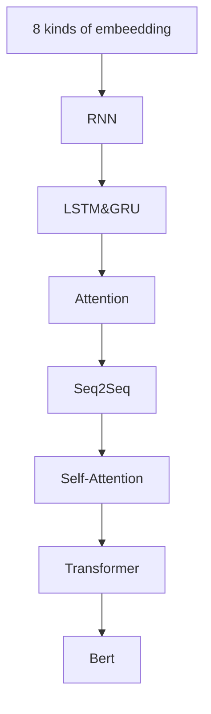

---
This is a daily update repository about QA_system
---

# 资源

https://www.bilibili.com/video/BV1JE411g7XF?from=search

# 笔记

```mermaid
graph TD
A[8 kinds of embeedding]-->B[RNN]
B-->C[LSTM&GRU]
C-->D[Attention]
D-->E[Seq2Seq]
E-->F[Self-Attention]
F-->G[Transformer]
G-->H[Bert]

```

# [Gan](Gan.md)

# [Transformer](Transformer.md)

